# 基于springboot的抗疫物资管理系统

---
### 👉作者QQ ：1556708905 微信：zheng0123Long (支持定制修改、部署调试、定制毕设)

### 👉接网站建设、小程序、H5、APP、各种系统等

---

#### 介绍

基于SpringBoot的抗疫物资管理系统旨在为各级管理人员和普通用户提供一个高效、透明和安全的物资管理平台。系统覆盖从物资入库、出库到使用全过程，实现对抗疫物资的动态管理，保障物资调配及时、准确、到位。管理员角色负责物资的整体管理和调度，而用户角色则主要负责查看公告信息和个人中心的管理。

#### 技术栈

后端技术栈：Springboot+Mysql+Maven

前端技术栈：Vue+Html+Css+Javascript+ElementUI

开发工具：Idea+Vscode+Navicate

#### 系统功能介绍

管理员角色功能模块  
个人中心：管理员可以管理个人信息，修改密码等。  
用户管理：管理系统中注册的用户信息，包括添加、删除和更新用户信息。  
公告信息管理：发布和管理有关抗疫物资的公告信息，确保信息及时传达给所有用户。  
物资分类管理：管理物资的分类信息，确保物资分类明确、查找方便。  
物资信息管理：管理详细的物资信息，包括物资名称、数量、规格等。  
物资入库管理：管理物资的入库记录，包括入库时间、数量、供应商等信息。  
物资出库管理：管理物资的出库记录，包括出库时间、数量、使用单位等信息。  
管理员管理：管理系统内的其他管理员账户，进行权限分配和管理。  
系统管理：对系统进行整体管理和维护，包括数据备份、日志管理等。  

用户角色功能模块  
首页：用户可以浏览系统的首页，查看最新的物资信息和公告。  
公告信息：查看管理员发布的公告信息，了解最新的抗疫物资调配和使用情况。  
个人中心：用户可以管理个人信息，修改密码等。  
后台管理：用户可在后台查看和管理相关信息，主要包括个人相关的物资申请记录等。  

#### 系统作用

提高物资管理效率：通过系统化管理，减少手工操作的复杂性和错误率，提高物资管理的整体效率。  
确保物资流向透明：每一笔物资的入库、出库都有详细的记录，确保物资流向透明可查。  
优化资源调配：通过对物资信息的实时管理和监控，优化资源调配，确保物资能够及时到达需要的地方。  
加强信息传递：公告信息模块确保了重要信息能够及时传递到每一个用户，提升了信息传递的效率和准确性。  
安全管理：通过多级权限管理，确保系统内数据的安全性，防止未经授权的访问和操作。  

#### 系统功能截图

代码结构

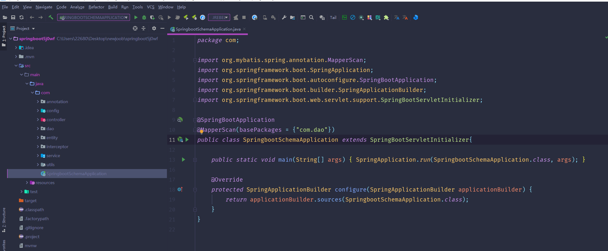

数据库表

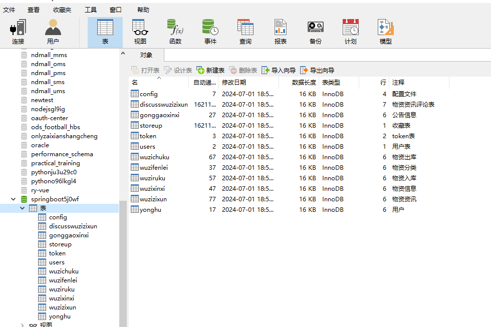

登录

个人中心

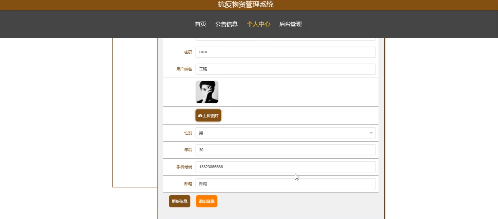

首页

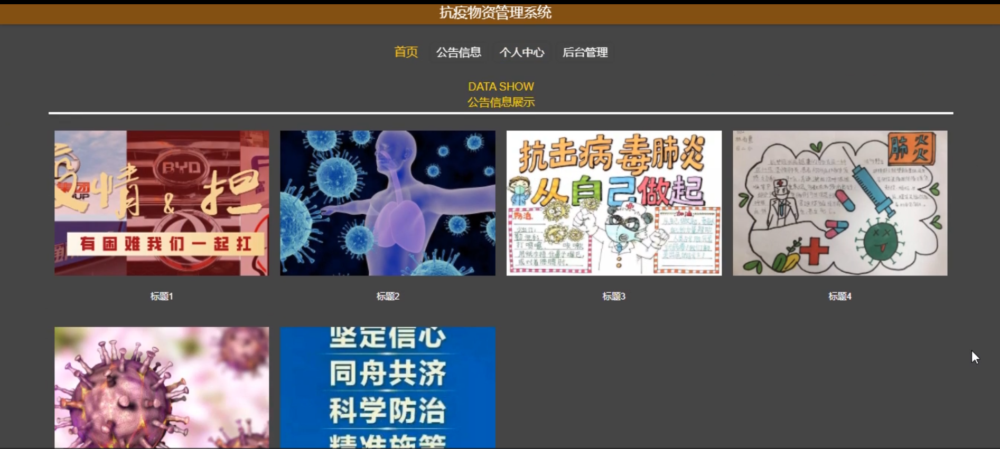

公告信息

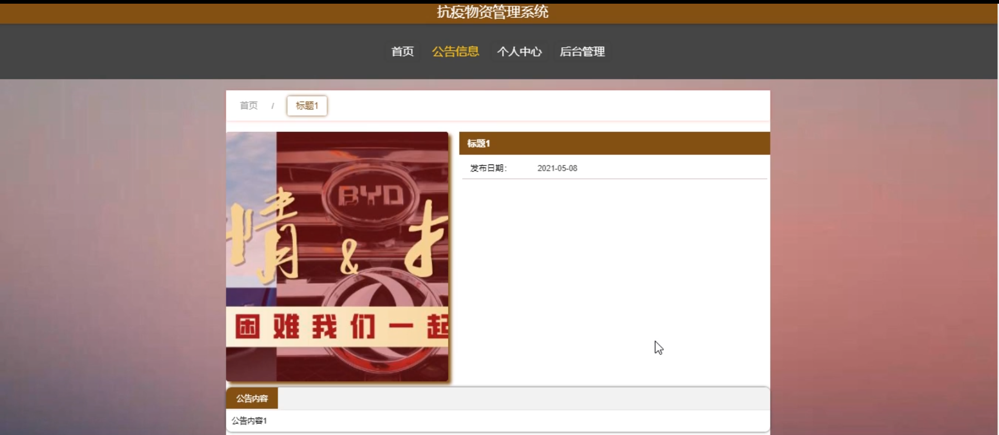

用户端后台管理

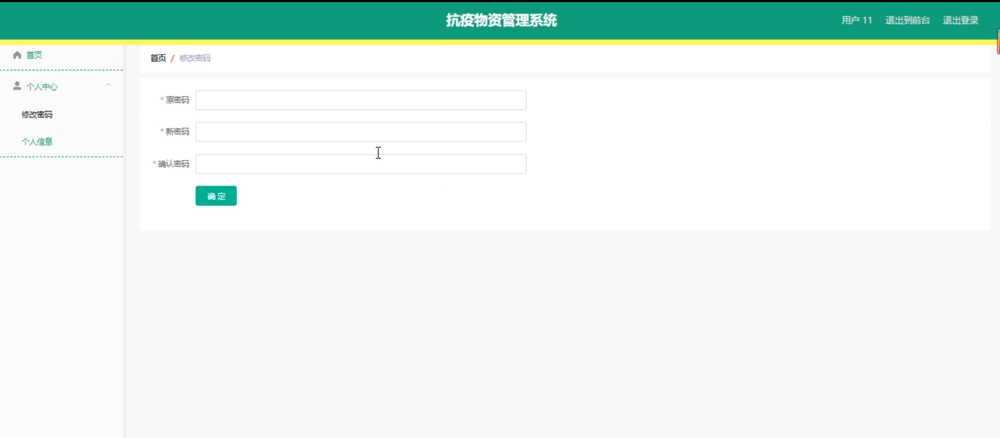

管理员端用户管理

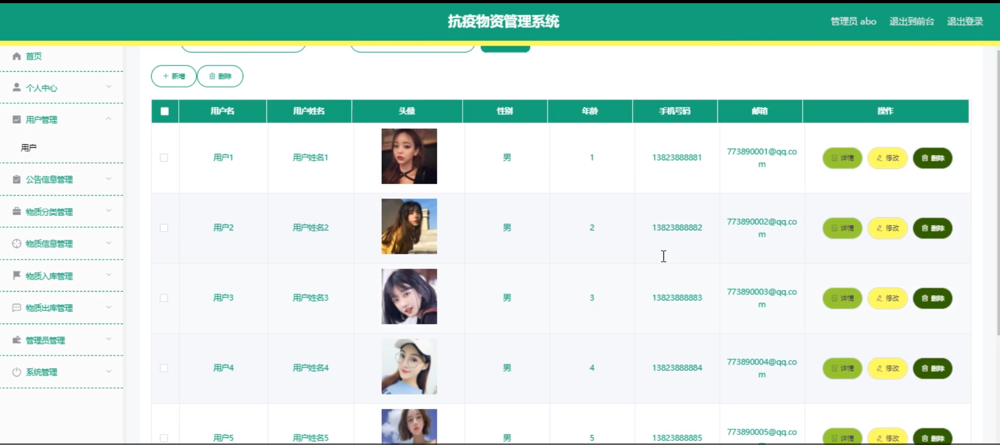

公告信息管理

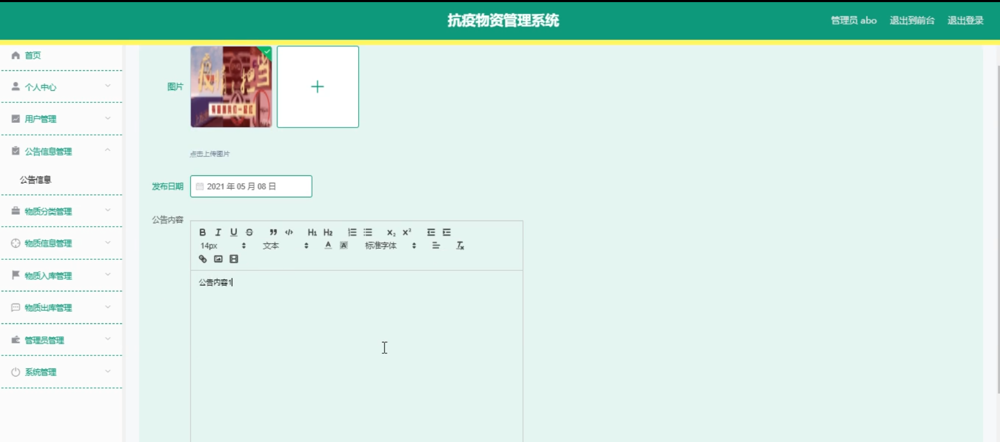

物质分类管理

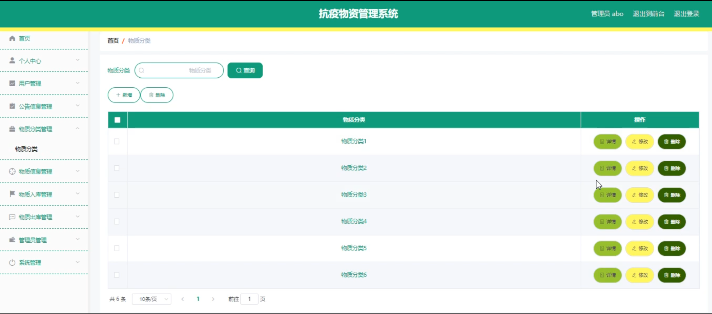

物质信息管理

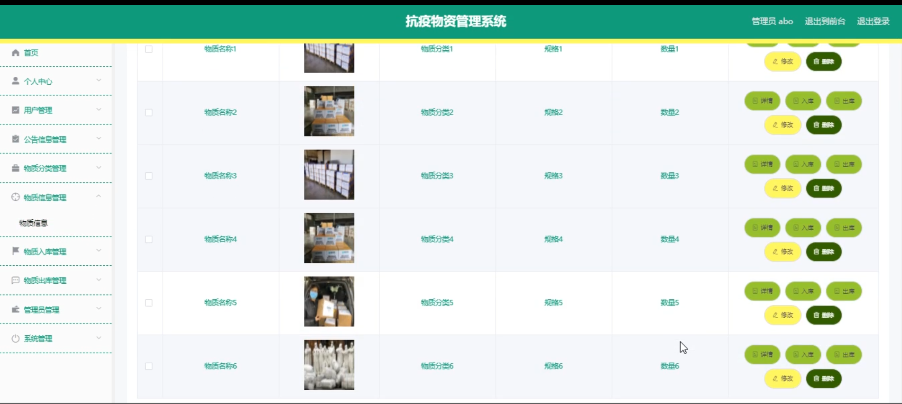

物质入库管理

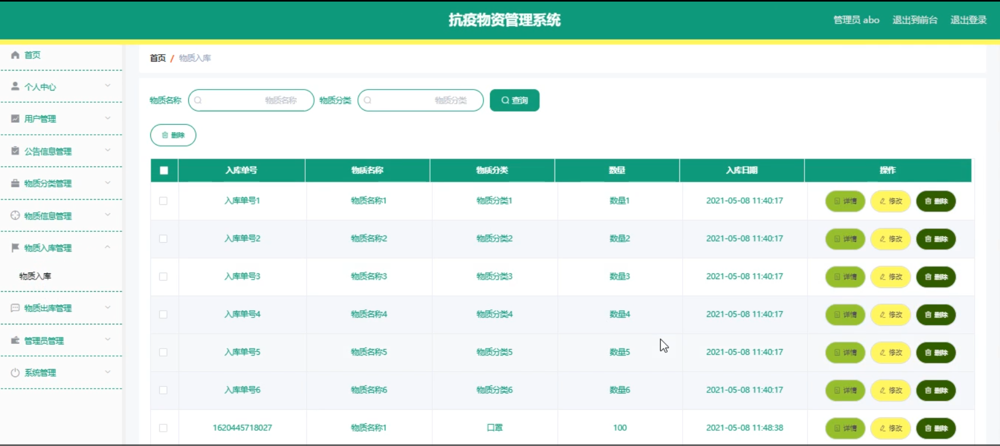

物质出库管理

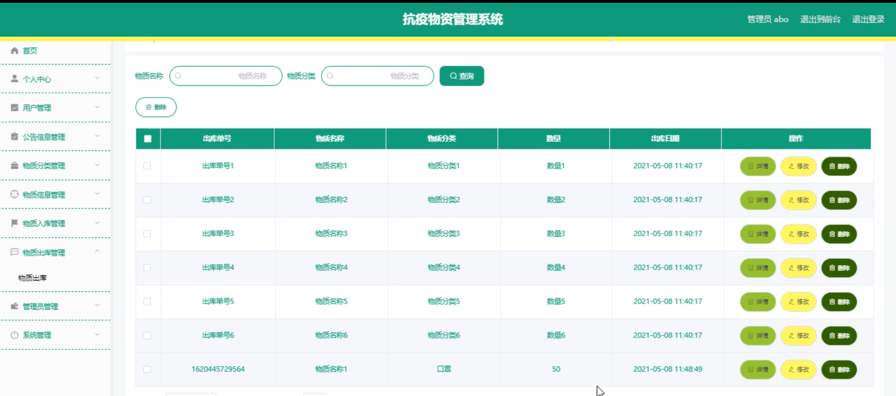

系统管理

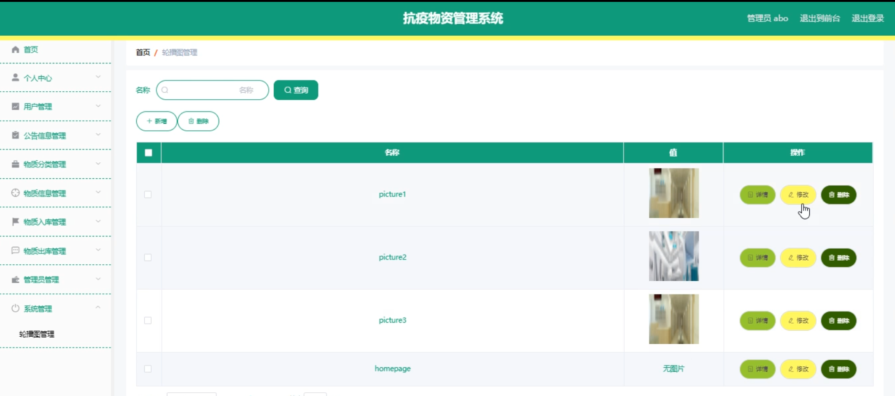

#### 总结

基于SpringBoot的抗疫物资管理系统为抗疫物资的管理提供了一个高效、透明、安全的平台。通过细化的功能模块，管理员能够全面掌握物资的流向和使用情况，用户能够及时获取相关信息并进行管理操作。系统不仅提高了物资管理的效率和准确性，还优化了资源的调配和使用，为抗疫工作提供了强有力的支持。

#### 使用说明

创建数据库，执行数据库脚本 修改jdbc数据库连接参数 下载安装maven依赖jar 启动idea中的springboot项目

后台地址：http://localhost:8080/springboot5j0wf/admin/dist/index.html

管理员  abo 密码 abo

前台地址：http://localhost:8080/springboot5j0wf/front/index.html

